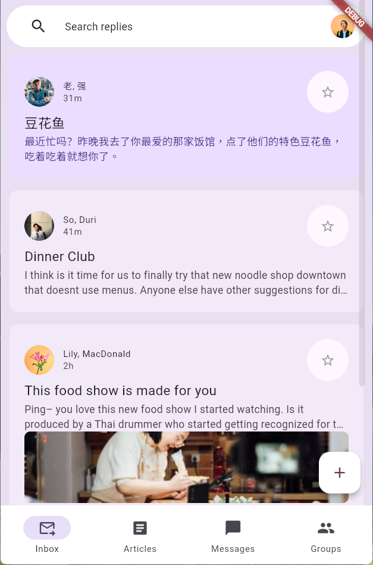
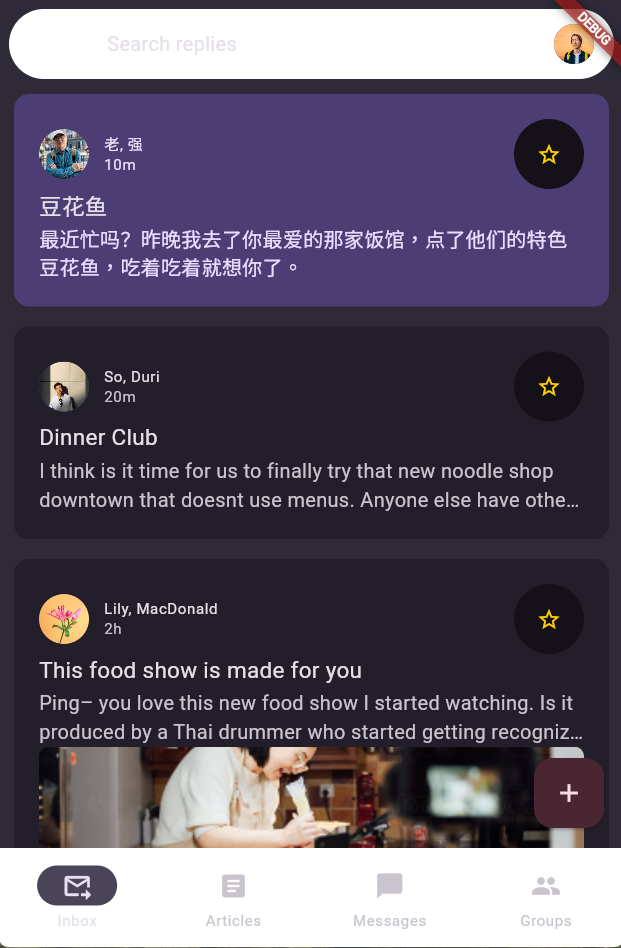

# animated_responsive_layout

# 📱 Flutter E-Mail UI & Dynamisches Theme-System

Eine responsive und interaktive E-Mail-App-Oberfläche, entwickelt mit Flutter. Bei diesem Projekt lag der primäre Fokus auf modernem UI/UX-Design, fließenden Übergängen (Material 3) und einer skalierbaren, sauberen Code-Architektur.

## 🏗 Projekt-Ursprung & Architektur-Refactoring

Die grundlegende visuelle Struktur (Split-View, Navigation Rail, Animationen) dieses Projekts basiert auf dem offiziellen Flutter-Tutorial: 
[Animated Responsive Layout](https://codelabs.developers.google.com/codelabs/flutter-animated-responsive-layout?hl=de#0)

**Eigenständige Erweiterungen & Modernisierung:**
Nach Abschluss der Basis-Implementierung habe ich die Code-Architektur eigenständig refaktorisiert, um eine professionelle "Separation of Concerns" (Trennung der Zuständigkeiten) zu gewährleisten. Die ursprünglich starren Design-Werte wurden vollständig entfernt und durch ein modulares, dynamisches Theme-System ersetzt:

* **Zentrale Farbverwaltung:** Auslagerung aller UI-Farben und Hex-Werte in eine dedizierte `app_colors.dart`. Dies ermöglicht eine effiziente und fehlerfreie Pflege der Corporate Identity.
* **Modulare Themes:** Erstellung separater Baupläne (`light_theme.dart` & `dark_theme.dart`), die auf die zentrale Farbpalette zugreifen.
* **State Hoisting:** Umbau der App-Einstiegsebene (`MainApp`) zu einem `StatefulWidget`. Der Zustand des Themes (Hell/Dunkel) wird nun global verwaltet und über Callbacks (`onThemeToggle`) sauber an tiefere Ebenen des Widget-Baums weitergereicht, ohne das UI-Design mit Logik zu überladen.

## ✨ Kern-Features

* **Responsive Layout:** Nahtloser und animierter Wechsel zwischen mobiler Ansicht (Bottom Navigation) und Desktop/Tablet-Ansicht (Navigation Rail).
* **Custom Animations:** Maßgeschneiderte Animations-Kurven fürV das Ein- und Ausblenden von UI-Elementen (z. B. Floating Action Button).
* **Dark & Light Mode:** Voll integrierter, performanter und zur Laufzeit umschaltbarer Theme-Wechsel mit optimierten Kontrastwerten für beide Modi.

## Architektur-Refactoring: UI-Showcase

Hier siehst du die Modernisierung der App nach dem Architektur-Umbau:





## 🛠 Tech Stack

* **Framework:** Flutter / Dart
* **Design System:** Material Design 3
* **Architektur-Fokus:** Separation of Concerns, State Management (Stateful/Stateless), Responsive UI

## 🚀 Installation & Start

1. Das Repository klonen:
   ```bash
   git clone https://github.com/Exoshiva/Animated_Responsive_App_Layout.
